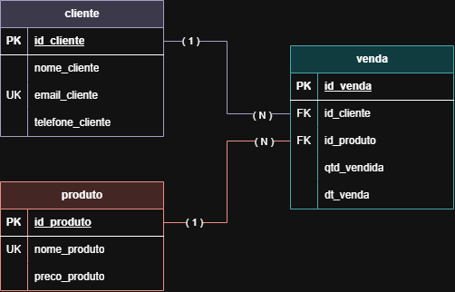

# Atividade 1 — Compra de Produtos (Banco de Dados)

Modelagem e criação de um banco de dados relacional (`empresa_vendas`) para registrar vendas de produtos a clientes, incluindo carga inicial de dados e atualizações.

## Descrição do problema

- **Cliente**: possui nome, e-mail e telefone.
- **Produto**: possui nome e preço.
- **Venda**: registra a quantidade vendida e a data da venda.
- Um cliente pode comprar vários produtos e um produto pode ser comprado por vários clientes (relação N:N, resolvida pela tabela `venda`).

## Modelo Entidade-Relacionamento (MER)



### Relacionamentos

| Relacionamento | Cardinalidade | Descrição |
|---|---|---|
| cliente → venda | 1:N | Um cliente pode ter várias vendas |
| produto → venda | 1:N | Um produto pode aparecer em várias vendas |

## Estrutura das tabelas

**cliente**

| Coluna | Tipo | Restrições |
|---|---|---|
| id_cliente | INT | PK, AUTO_INCREMENT |
| nome_cliente | VARCHAR(100) | NOT NULL |
| email_cliente | VARCHAR(100) | NOT NULL, UNIQUE |
| telefone_cliente | VARCHAR(15) | NOT NULL |

**produto**

| Coluna | Tipo | Restrições |
|---|---|---|
| id_produto | INT | PK, AUTO_INCREMENT |
| nome_produto | VARCHAR(100) | NOT NULL, UNIQUE |
| preco_produto | DECIMAL(10,2) | NOT NULL |

**venda**

| Coluna | Tipo | Restrições |
|---|---|---|
| id_venda | INT | PK, AUTO_INCREMENT |
| id_cliente | INT | NOT NULL, FK → cliente(id_cliente) |
| id_produto | INT | NOT NULL, FK → produto(id_produto) |
| qtd_vendida | INT | NOT NULL |
| dt_venda | DATE | NOT NULL |

## Script SQL

### 1. Criação do banco e das tabelas

```sql
CREATE DATABASE empresa_vendas;

USE empresa_vendas;

CREATE TABLE cliente (
    id_cliente INT PRIMARY KEY AUTO_INCREMENT,
    nome_cliente VARCHAR(100) NOT NULL,
    email_cliente VARCHAR(100) NOT NULL UNIQUE,
    telefone_cliente VARCHAR(15) NOT NULL
);

CREATE TABLE produto (
    id_produto INT PRIMARY KEY AUTO_INCREMENT,
    nome_produto VARCHAR(100) NOT NULL,
    preco_produto DECIMAL(10, 2) NOT NULL
);

CREATE TABLE venda (
    id_venda INT PRIMARY KEY AUTO_INCREMENT,
    id_cliente INT NOT NULL,
    id_produto INT NOT NULL,
    qtd_vendida INT NOT NULL,
    dt_venda DATE NOT NULL,
    FOREIGN KEY (id_cliente) REFERENCES cliente(id_cliente),
    FOREIGN KEY (id_produto) REFERENCES produto(id_produto)
);
```

### 2. Inserção de dados

```sql
INSERT INTO cliente (nome_cliente, email_cliente, telefone_cliente)
VALUES ('Ana Beatriz silva', 'ana.beatriz.silva@hotmail.com', '(11) 98742-3156');

INSERT INTO cliente (nome_cliente, email_cliente, telefone_cliente)
VALUES ('Gabriel Henrique Souza', 'gabriel.henrique.souza@gmail.com', '(21) 97631-4285');

INSERT INTO cliente (nome_cliente, email_cliente, telefone_cliente)
VALUES ('Lucas Almeida Santos', 'lucas.almeidasantos@outlook.com', '(31) 99158-6732');

INSERT INTO produto (nome_produto, preco_produto)
VALUES ('Notebook Dell', 3500.00);

INSERT INTO produto (nome_produto, preco_produto)
VALUES ('Smartphone Sansung', 2500.00);

INSERT INTO produto (nome_produto, preco_produto)
VALUES ('Tablet Apple', 2750.00);

INSERT INTO venda (id_cliente, id_produto, qtd_vendida, dt_venda)
VALUES (1, 1, 1, '2024-06-01');

INSERT INTO venda (id_cliente, id_produto, qtd_vendida, dt_venda)
VALUES (3, 2, 2, '2024-06-02');

INSERT INTO venda (id_cliente, id_produto, qtd_vendida, dt_venda)
VALUES (2, 3, 1, '2024-06-03');
```

### 3. Alteração de estrutura (constraint)

Garante que não existam dois produtos com o mesmo nome:

```sql
ALTER TABLE produto
ADD CONSTRAINT uk_produto_unico UNIQUE (nome_produto);
```

### 4. Correções nos dados (UPDATE)

```sql
-- Corrige a capitalização do nome do cliente
UPDATE cliente
SET nome_cliente = 'Ana Beatriz Silva'
WHERE id_cliente = 1;

-- Corrige o erro de digitação no nome do produto
UPDATE produto
SET nome_produto = 'Smartphone Samsung'
WHERE id_produto = 2;

-- Atualiza o preço do produto
UPDATE produto
SET preco_produto = 4500.00
WHERE id_produto = 3;

-- Corrige o e-mail do cliente
UPDATE cliente
SET email_cliente = 'lucas.almeida.santos@outlook.com'
WHERE id_cliente = 3;
```

## Como executar

1. Abra o MySQL (Workbench, terminal ou outro cliente).
2. Execute os blocos do script na ordem (1 → 4).
3. Confira o resultado:

```sql
SHOW TABLES;
DESCRIBE venda;

SELECT * FROM cliente;
SELECT * FROM produto;
SELECT * FROM venda;
```

4. (Opcional) Consulta juntando as três tabelas:

```sql
SELECT v.id_venda,
       c.nome_cliente,
       p.nome_produto,
       v.qtd_vendida,
       p.preco_produto * v.qtd_vendida AS total,
       v.dt_venda
FROM venda v
JOIN cliente c ON c.id_cliente = v.id_cliente
JOIN produto p ON p.id_produto = v.id_produto;
```

## Tecnologias

- MySQL
- Modelagem MER (diagrama)
